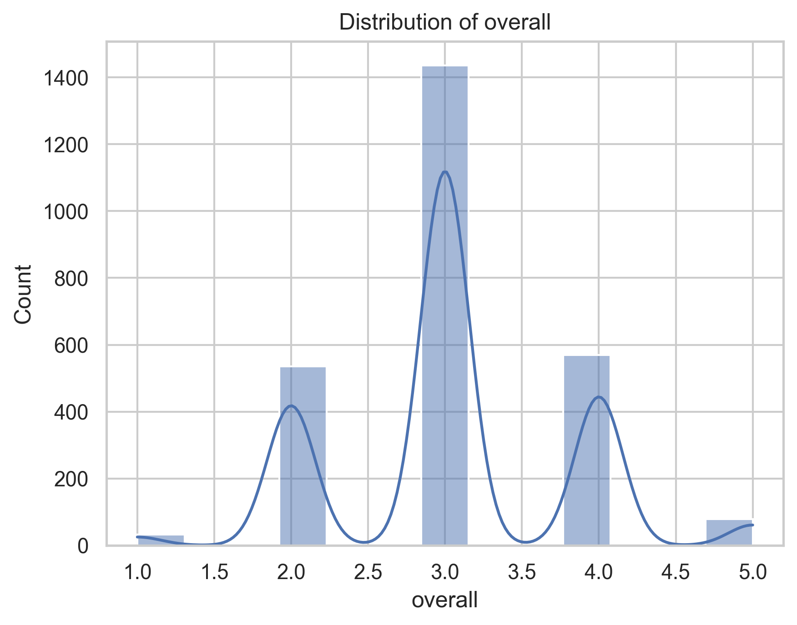
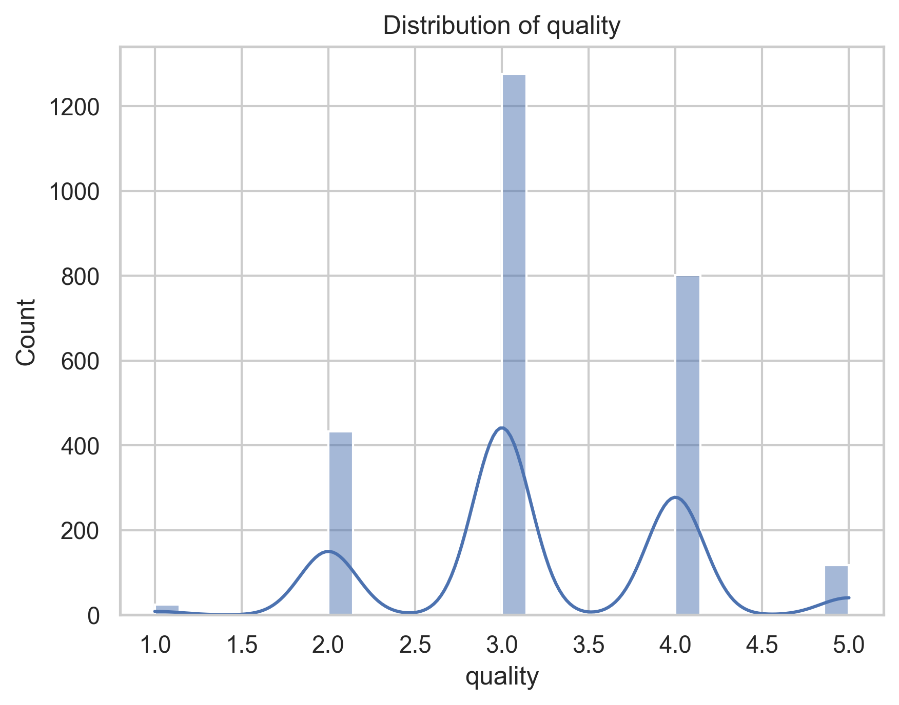
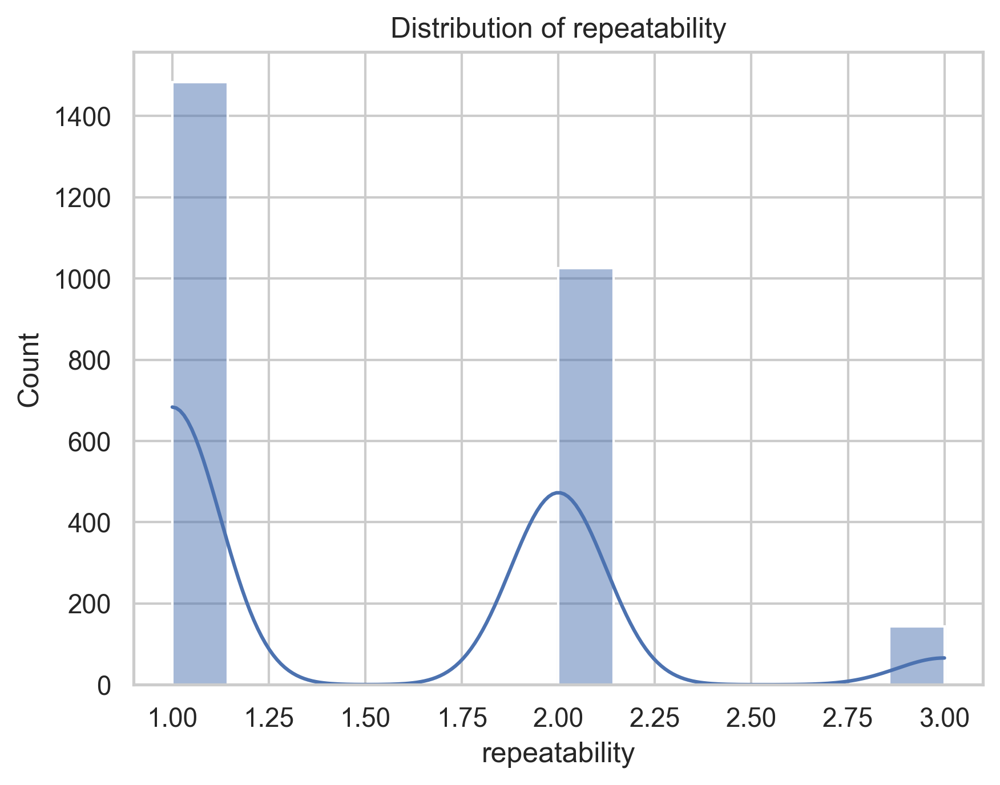

# Analysis Report

Based on the summary data provided, let's perform a detailed analysis focusing on various fields, notable trends, distributions, correlations, and areas of potential improvement or further investigation.

### 1. **Data Overview**
The dataset contains 2,652 records with specific attributes related to movies. Key fields examined include date, language, type, title, contributor (by), overall ratings, quality ratings, and repeatability ratings. Missing data has also been noted.

---

### 2. **Field Analysis**

#### a. **Date**
- **Count**: 2,553 (99 missing values)
- **Unique Entries**: 2,055 (top date: '21-May-06', frequency: 8)
- **Observations**: The significant number of unique dates suggests a broad time range for the records. The presence of 99 missing values may indicate issues with data entry or collection.

#### b. **Language**
- **Count**: 2,652 (no missing values)
- **Unique Languages**: 11 (top language: English, frequency: 1,306)
- **Observations**: English overwhelmingly dominates this dataset. This is an important factor as it may impact the audience size. The lack of missing values is a strong point in the dataset's integrity.

#### c. **Type**
- **Count**: 2,652 (no missing values)
- **Unique Types**: 8 (top type: 'movie', frequency: 2,211)
- **Observations**: The dominance of the "movie" type (over 83% of the data) suggests a focused collection, although additional types (such as series, documentary, etc.) might offer deeper insights into the media landscape.

#### d. **Title**
- **Count**: 2,652 (no missing values)
- **Unique Titles**: 2,312 (top title: 'Kanda Naal Mudhal', frequency: 9)
- **Observations**: A vast number of unique titles suggests diverse content. However, some titles may be more frequently referenced than others, warranting an analysis of why certain titles are more prominent.

#### e. **By (Contributors)**
- **Count**: 2,390 (262 missing values)
- **Unique Contributors**: 1,528 (top contributor: Kiefer Sutherland, frequency: 48)
- **Observations**: The high number of unique contributors indicates a wide range of talent involved. The missing values could be addressed to include more comprehensive data on contributors.

#### f. **Overall Ratings**
- **Count**: 2,652 (no missing values)
- **Mean**: ~3.05 (on a scale of 1 to 5)
- **Standard Deviation**: ~0.76
- **Distribution**: Ratings appear concentrated around the mean, evident from the 25th to 75th percentile (3.0 to 3.0), indicating consistent ratings across several records.

#### g. **Quality Ratings**
- **Mean**: ~3.21
- **Standard Deviation**: ~0.80
- **Observations**: Similar distribution to overall ratings, suggesting a positive perception of quality.

#### h. **Repeatability Ratings**
- **Mean**: ~1.49
- **Standard Deviation**: ~0.60
- **Observations**: The mean indicates that most titles are likely to be considered for a single viewing, with lower values reflecting less repeat interest.

---

### 3. **Correlations**
- The correlation matrix indicates strong relationships:
  - **Overall with Quality**: Strong positive correlation (0.826), suggesting that higher overall ratings tend to coincide with higher quality perceptions.
  - **Overall with Repeatability**: Moderate correlation (0.513).
  - **Quality with Repeatability**: Weaker correlation (0.312), indicating that while quality affects overall impressions, it does not significantly drive repeat views.

---

### 4. **Missing Values Analysis**
- The presence of missing values in the "date" and "by" fields could impair the analysis of trends over time and contributions, respectively. It would be beneficial to investigate the reasons for these gaps and seek to populate this information if possible.

---

### 5. **Conclusion & Recommendations**
1. **Data Completeness**: Efforts should be made to address missing values, especially in "date" and "by" fields, to enhance analysis capabilities.
   
2. **Content Diversity**: Although there is a rich variety of titles and contributors, analysis of less-represented categories and languages could uncover additional insights.

3. **Further Investigations**: Consider investigating the reasons behind specific title performances, especially for frequently occurring titles. A separate analysis of trends over time (e.g., through scatter plots) could reveal patterns in audience preference shifts.

4. **Audience and Marketing Strategies**: Leverage the language and type data to target different audience segments. Given the dominance of English language movies, exploring multilingual offerings could enhance market reach.

Overall, this dataset provides a strong foundation for understanding media consumption patterns, but attention to data integrity and breadth will enhance its analytical potential.

### Overall Distribution

### Quality Distribution

### Repeatability Distribution

